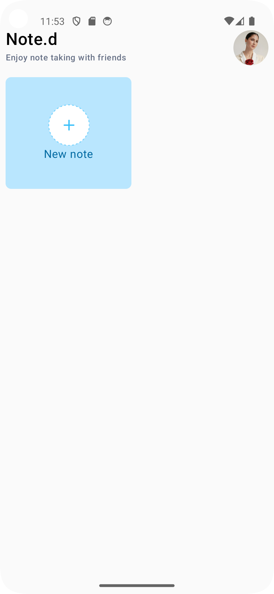
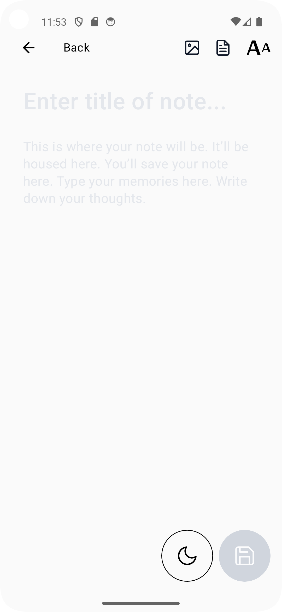
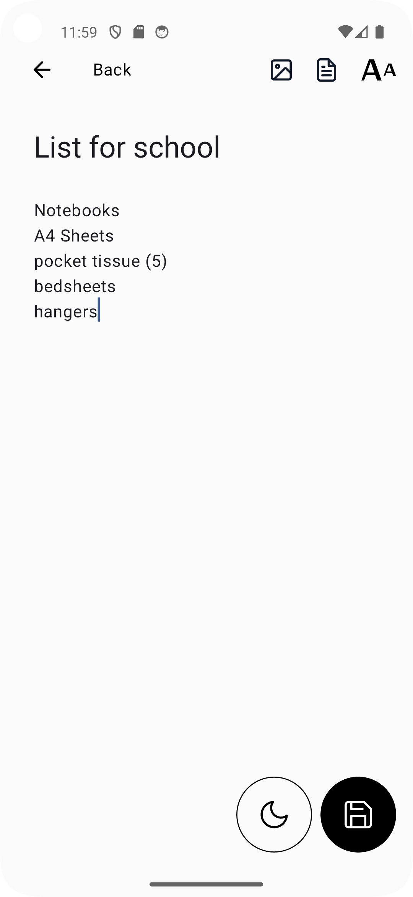
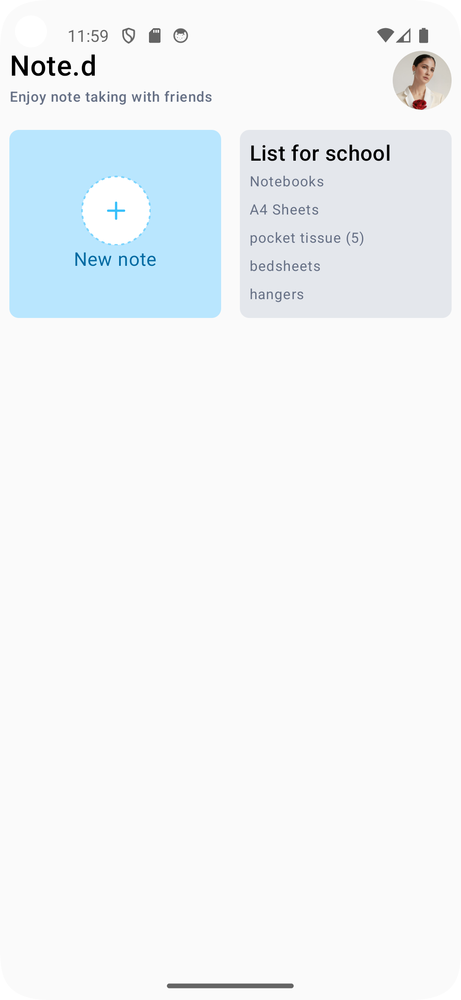
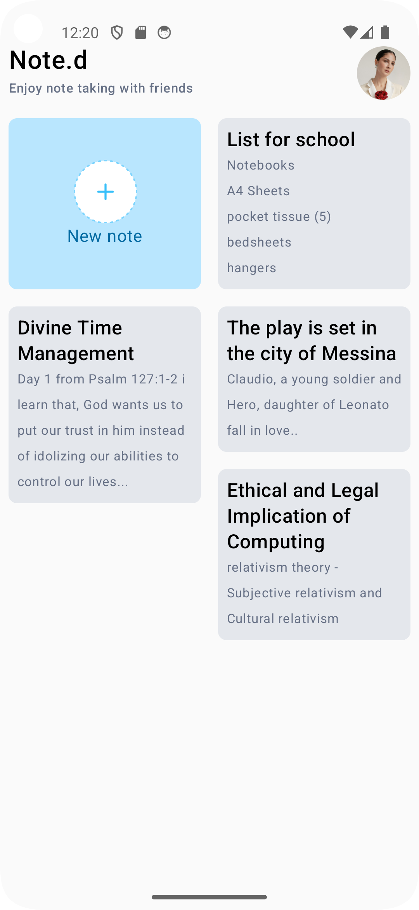

# Note.d

Note.d is an android app that allows you to take notes built
with Jetpack Compose.

## Prerequisite

To build this project you require:

- Android Studio Koala 2024.1.1 or higher
- Gradle 8.4.2+
- Kotlin 2.0.0+

# Technologies Used

- [Jetpack Compose](https://developer.android.com/develop/ui/compose): Android's modern UI Toolkit
- [Kotlinx Serialization](https://kotlinlang.org/docs/serialization.html): Cross platform framework
  for data serialization.
- [Room database](https://developer.android.com/training/data-storage/room): Library that provides an abstraction layer over SQLite to allow for more robust database access while harnessing the full power of SQLite.
- [Hilt](https://dagger.dev/hilt/): Hilt provides a standard way to incorporate Dagger dependency injection into an Android application.
# Screenshots

<table>
  <tr>
    <td>
      
    </td>
    <td>
      
    </td>
    <td>
      
    </td>
    <td>
      
    </td>
    <td>
      
    </td>
  </tr>
</table>
